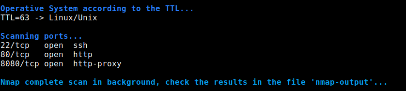
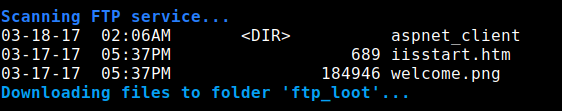
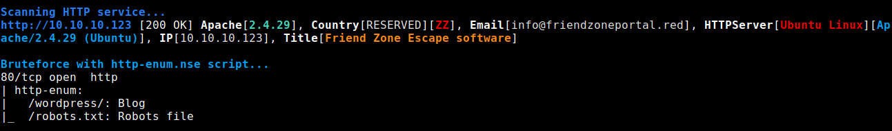
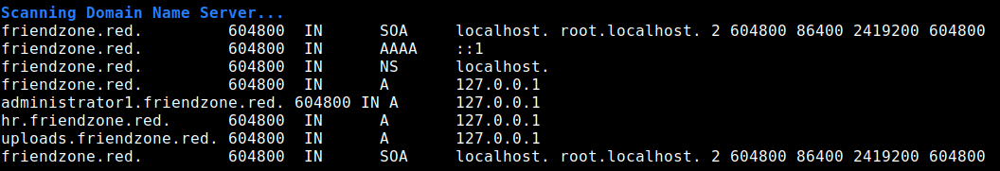
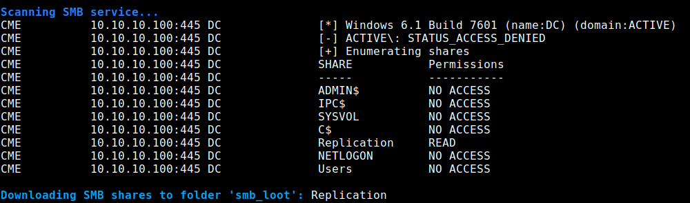
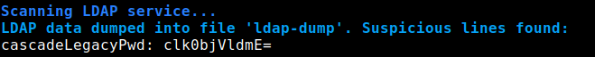
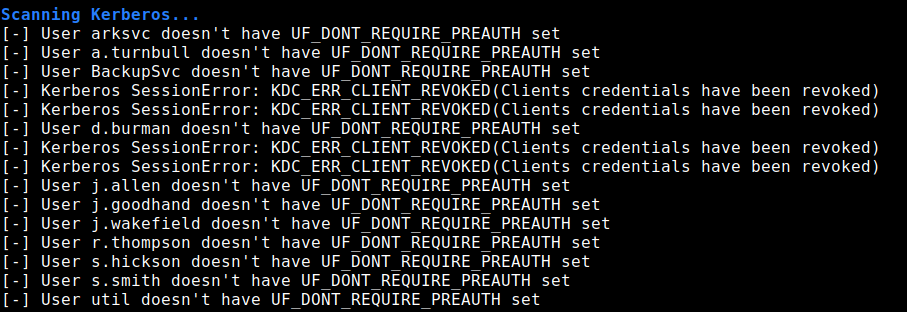
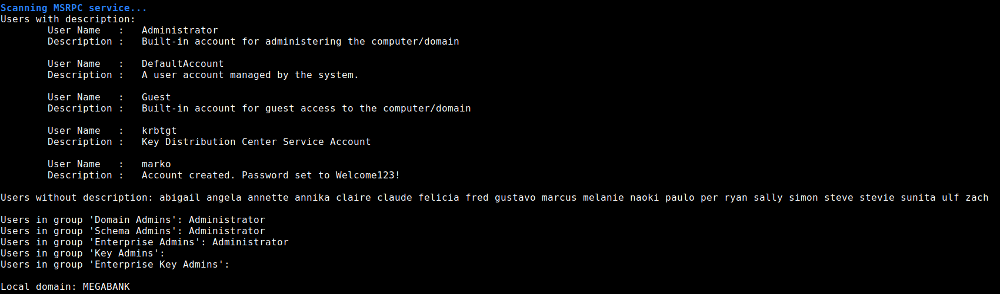

```
  ______ _                                  _       _            
 |  ____(_)                                (_)     | |           
 | |__   _ _ __   __ _  ___ _ __ _ __  _ __ _ _ __ | |_ ___ _ __ 
 |  __| | | '_ \ / _` |/ _ \ '__| '_ \| '__| | '_ \| __/ _ \ '__|
 | |    | | | | | (_| |  __/ |  | |_) | |  | | | | | ||  __/ |   
 |_|    |_|_| |_|\__, |\___|_|  | .__/|_|  |_|_| |_|\__\___|_|   
                  __/ |         | |                              
                 |___/          |_|          BY CR4ZYGOAT        							
```

# Introduction
The aim of this tool is to perform the fingerprinting scan of a machine, in order to identify the target, the running services and the available information from them. There are many tools to gather useful information once inside the machine (privilege escalation phase), but that's not the case from outside (fingerprinting phase).

The most similar tool I found is [autorecon](https://github.com/Tib3rius/AutoRecon), but this last one don't completely match what I was looking for. I was searching for a more precise and intrusive tool, which gives you the important information in the stdoutput, and even tries to download files or login to some services. On the other hand, *autorecon* is more powerful, perform many more analysis and accept different targets at the same time.

**Use this tool always with the proper authorization of the client. I'm not responsible for the misuse of this tool. I tested the different services and scenarios against virtual machines from the platform *HackTheBox*, which were already retired and rooted. Also, the images and information used in this README file correspond to these machines.**

# Requirements
This tool just need to things to run:

- Bash terminal
- Nmap scanning tool

Of course, this tool uses many other tools to analyze the different services, but these ones aren't mandatory. If one test requires a missing tool, that will be notified to the user and the test will be skipped, but the execution won't stop.

No root privileges needed for any check, so execute this tool as a normal user.

# Command line options
By default, this tools doesn't realize any intrusive action, neither download files nor try to login. However, could be executed with the following arguments:

```
Usage: ./fingerprinter.sh [options] target
    Required arguments:
        target                      Address of the target to scan
    Optional arguments:
        -d, --domain                Domain name
        -u, --username              Username (Default: blank)
        -p, --password              Password (Default: blank)
        -f, --download-files        Download files from target (Default: no)
```

# Scans & checks
So far, this tools perform the following scans and checks:

- OS & ports
- FTP
- HTTP/S
- DNS
- SMB
- LDAP
- Kerberos
- MSRPC

More services will be supported in the future, and more checks per service as well.

### OS and ports


### FTP Scan


### HTTP/S Scan


### DNS Scan


### SMB Scan


### LDAP Scan


### Kerberos Scan


### MSRPC


# Results
The most of the results are shown through the stdoutput (terminal). However, some files and folders are created to save long outputs or downloaded files. These are the following ones:

- nmap-output: File to save the nmap result for the full scan
- ldap-dump: File to save all the information gathered from LDAP
- users.txt: File to save all the users found (wordlist)
- ftp_loot: Folder to store the files downloaded from FTP service
- smb_loot: Folder to store the files downloaded from SMB service

# Contribution
I would like to improve this tool with your help, not only with new functionalities and services, but also improving the ones already implemented. Because of that, **I would really appreciate any tip or suggestion**.

However, let me clarify one thing: **This isn't a bruteforce tool**, so don't ask for bigger dictionaries or massive bruteforce attacks, just use the gathered information.
